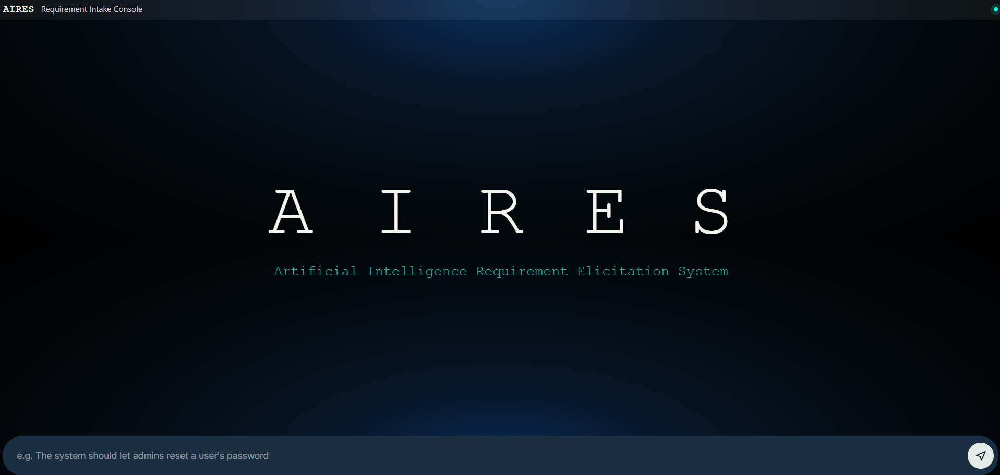
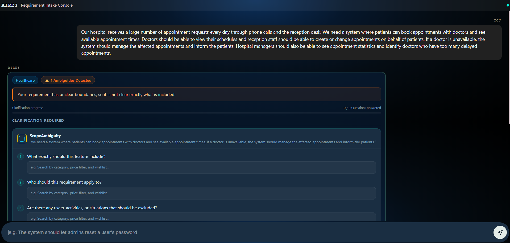
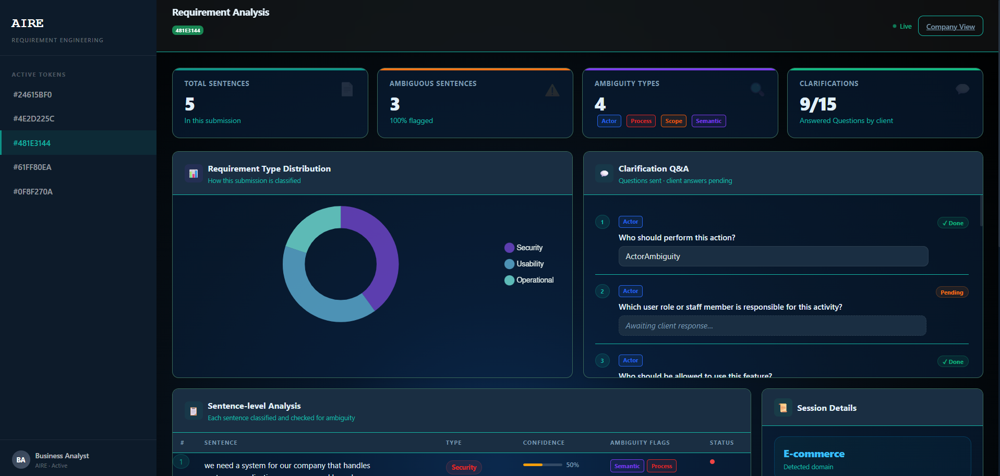
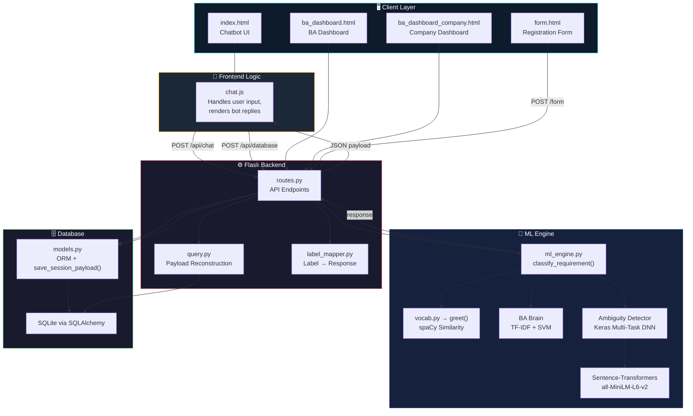
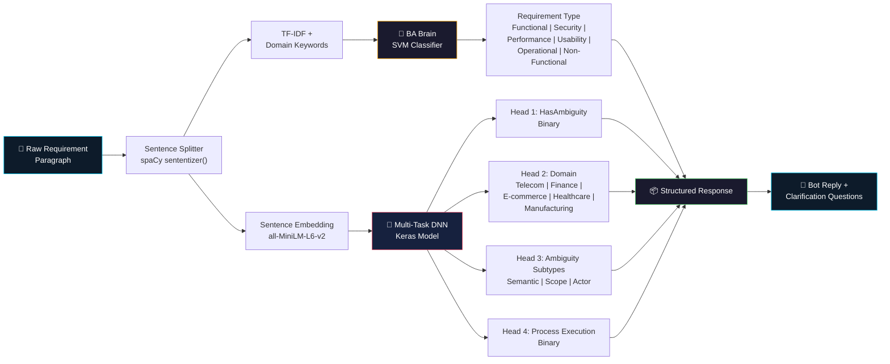
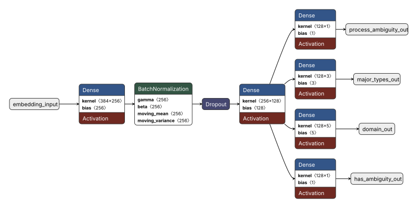
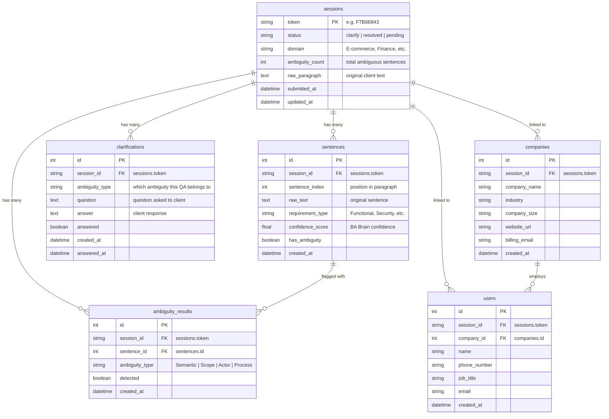
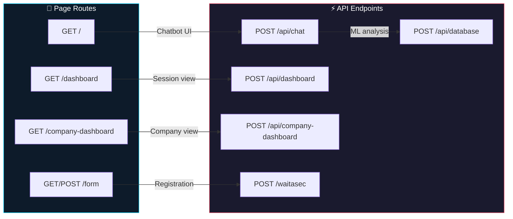
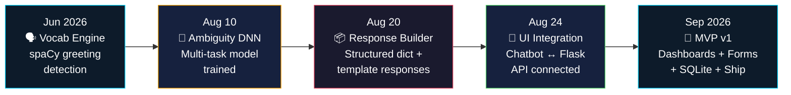

<div align="center">

# 🤖 AIRES

### Artificial Intelligence Requirement Elicitation System

[](https://python.org)
[](https://flask.palletsprojects.com)
[](https://tensorflow.org)
[](https://spacy.io)
[](https://scikit-learn.org)
[](https://sqlite.org)

> **AI-powered web system that bridges the gap between unstructured client requirements and structured software artifacts.**

AIRES analyses raw requirement text submitted through a chatbot interface, classifies each sentence by requirement type, detects multiple categories of ambiguity using deep-learning models, and guides the client through clarifying questions — all in real time.

</div>

---

## 📑 Table of Contents

- [Screenshots](#-screenshots)
- [Key Features](#-key-features)
- [System Architecture](#-system-architecture)
- [ML Pipeline](#-ml-pipeline)
- [Tech Stack](#-tech-stack)
- [ER Diagram](#-er-diagram)
- [API Routes](#-api-routes)
- [Project Structure](#-project-structure)
- [Quick Start](#-quick-start)
- [Target Users](#-target-users)
- [Project Status](#-project-status)
- [Development Timeline](#-development-timeline)

---

## 📸 Screenshots

<div align="center">

<table>
  <tr>
    <td align="center"><b>🏠 Chatbot Landing Page</b></td>
  </tr>
  <tr>
    <td></td>
  </tr>
</table>

<table>
  <tr>
    <td align="center"><b>💬 Ambiguity Detection & Clarification</b></td>
    <td align="center"><b>📊 BA Analytics Dashboard</b></td>
  </tr>
  <tr>
    <td></td>
    <td></td>
  </tr>
</table>

</div>

---

## ✨ Key Features

| Feature                               | Description                                                                                                                           |
| :------------------------------------ | :------------------------------------------------------------------------------------------------------------------------------------ |
| 🧠 **Requirement Classification**     | SVM classifier with TF-IDF + domain keywords identifies requirement types (Functional, Security, Performance, Usability, Operational) |
| 🔍 **Multi-Task Ambiguity Detection** | Keras DNN with 4 output heads detects Semantic, Scope, Actor & Process Execution ambiguities                                          |
| 💬 **Intelligent Chatbot**            | spaCy-powered greeting engine + structured clarification Q&A flow                                                                     |
| 📊 **BA Dashboard**                   | Per-session & per-company analytics with requirement distribution charts and ambiguity flags                                          |
| 🏢 **Client Management**              | Company & user registration with duplicate detection and auto-fill                                                                    |
| 🗄️ **Full Persistence**               | SQLite database with 6 normalised tables via SQLAlchemy ORM                                                                           |

---

## 🏗️ System Architecture



---

## 🧠 ML Pipeline



### Neural Network Architecture (Netron)

<div align="center">
  
  <br/>
  <sub><i>Multi-Task DNN architecture exported from Netron — 4 output heads for ambiguity detection</i></sub>
</div>

<br/>

### Model Details

| Model                  | Algorithm                         | Input                 | Output                        | Artifacts                                             |
| :--------------------- | :-------------------------------- | :-------------------- | :---------------------------- | :---------------------------------------------------- |
| **BA Brain**           | SVM + TF-IDF + domain keywords    | Preprocessed sentence | Requirement type + confidence | `ba_brain_model.pkl`, `ba_brain_tfidf.pkl`            |
| **Ambiguity Detector** | Multi-task DNN (4 heads)          | Sentence embeddings   | Ambiguity flags per type      | `multitask_ambiguity_model.keras`, `edge_values.json` |
| **Greeting Engine**    | Cosine similarity (spaCy vectors) | User message          | Greeting type + response      | `vocab.json`                                          |

> **Training Data**: `Cornelius_2025_user_story_ambiguity_dataset` augmented with synthetic data generated via ChatGPT & Grok to address class imbalance in ambiguity-positive samples.

---

## 🛠️ Tech Stack

```mermaid
flowchart LR
    subgraph Frontend
        HTML["HTML5"]
        CSS["CSS3"]
        JSS["JavaScript"]
    end

    subgraph Backend
        FLASK2["Flask 3.1"]
        WTF["Flask-WTF"]
        SA["SQLAlchemy"]
    end

    subgraph AI["AI / ML"]
        TF["TensorFlow"]
        KERAS["Keras"]
        SKLEARN["scikit-learn"]
        SPACY["spaCy"]
        ST["Sentence-Transformers"]
    end

    subgraph Data
        SQLITE2["SQLite"]
        PANDAS["pandas"]
        NUMPY["NumPy"]
    end

    Frontend --> Backend
    Backend --> AI
    Backend --> Data
    AI --> Data

    style Frontend fill:#0d1b2a,stroke:#00d4ff,color:#fff
    style Backend fill:#1a1a2e,stroke:#e94560,color:#fff
    style AI fill:#16213e,stroke:#ffa500,color:#fff
    style Data fill:#1a1a2e,stroke:#53d769,color:#fff
```



---

## 🗃️ ER Diagram



---

## 🔌 API Routes



| Route                    |  Method  | Description                                                    |
| :----------------------- | :------: | :------------------------------------------------------------- |
| `/`                      |   GET    | Chatbot UI — requirement intake console                        |
| `/api/chat`              |   POST   | Core ML API — accepts `{ "message": "..." }`, returns analysis |
| `/api/database`          |   POST   | Persists full session payload to SQLite                        |
| `/dashboard`             |   GET    | BA dashboard — per-session analytics                           |
| `/api/dashboard`         |   POST   | Fetch reconstructed payload for a given token                  |
| `/company-dashboard`     |   GET    | BA dashboard — per-company aggregate view                      |
| `/api/company-dashboard` |   POST   | Fetch company payload by `companyId`                           |
| `/form`                  | GET/POST | Client registration form (Flask-WTF)                           |
| `/waitasec`              |   POST   | Duplicate-check lookup for company/user pre-fill               |

---

## 📁 Project Structure

```
Project/
├── 📄 README.md                         ← you are here
├── 📄 technical.md                      development logs & design notes
├── 📄 requirements.txt                  pip dependencies
├── 🖼️ image.png                         chatbot landing screenshot
├── 🖼️ image-1.png                       ambiguity detection screenshot
├── 🖼️ image-2.png                       BA dashboard screenshot
│
└── project_AIRES/
    ├── 🚀 run.py                        Flask entry point
    ├── 📄 pyproject.toml                package metadata
    ├── 📄 dev-requirements.txt          dev-only deps
    ├── 🧪 tests/                        unit tests & fixtures
    │
    └── AIRES/                           main application package
        ├── __init__.py                  Flask app + SQLAlchemy init
        ├── routes.py                    all Flask routes
        ├── models.py                    ORM models + save_session_payload()
        ├── ml_engine.py                 classify_requirement() orchestrator
        ├── vocab.py                     NLP pipeline (greet, classify, detect)
        ├── label_mapper.py              ML label → human response
        ├── query.py                     DB → payload reconstruction
        │
        ├── 🤖 ba_brain_model.pkl        trained SVM classifier
        ├── 🤖 ba_brain_tfidf.pkl        fitted TF-IDF vectoriser
        ├── 🤖 multitask_ambiguity_model.keras  multi-task Keras DNN
        ├── 📊 edge_values.json          decision thresholds
        ├── 📊 vocab.json                greeting vocab & templates
        ├── 📊 domain_vocab.json         domain keyword features
        ├── 📊 requirement_classifier.json
        │
        ├── templates/                   Jinja2 HTML
        │   ├── index.html               chatbot page
        │   ├── ba_dashboard.html        session dashboard
        │   ├── ba_dashboard_comany.html  company dashboard
        │   ├── form.html                registration form
        │   └── fromRes.html             confirmation page
        │
        └── static/
            ├── css/style.css            UI styles
            └── js/chat.js               chatbot client logic
```

---

## 🚀 Quick Start

```bash
# 1. Clone the repository
git clone https://github.com/FahadhCodes/project_AIRES.git
cd project_AIRES

# 2. Create & activate a virtual environment
python -m venv .venv
.venv\Scripts\activate        # Windows
# source .venv/bin/activate   # macOS / Linux

# 3. Install dependencies
pip install -r ../requirements.txt

# 4. Start the server
python run.py
```

> 🌐 The app launches at **http://localhost:5000**

---

## 👥 Target Users

| Role                     | How AIRES Helps                                                                          |
| :----------------------- | :--------------------------------------------------------------------------------------- |
| 🏢 **Clients**           | Chat anytime, submit requirements in plain English, track progress via unique tokens     |
| 📋 **Business Analysts** | Receive structured, classified requirements with ambiguity reports and clarification Q&A |
| 📈 **Project Managers**  | Evaluate scope, cost, and timeline with clearer initial requirements                     |
| 🧪 **QA Engineers**      | Start from unambiguous, classified requirements to write better test cases               |
| 💻 **Developers**        | Build from well-defined, non-overlapping requirement specifications                      |

---

## 📋 Project Status

| Milestone                                                         |     Status     |
| :---------------------------------------------------------------- | :------------: |
| Goal formulation & user stories                                   |    ✅ Done     |
| Data model design (6 tables)                                      |    ✅ Done     |
| Vocabulary & greeting engine (spaCy NLP)                          |    ✅ Done     |
| Requirement type classifier (TF-IDF + SVM)                        |    ✅ Done     |
| Multi-task ambiguity detector (Keras DNN + Sentence-Transformers) |    ✅ Done     |
| Chatbot UI (HTML/CSS/JS ↔ Flask API)                              |    ✅ Done     |
| BA Dashboard (per-session & per-company views)                    |    ✅ Done     |
| Client registration form (Flask-WTF)                              |    ✅ Done     |
| SQLite persistence via SQLAlchemy                                 |    ✅ Done     |
| User/company duplicate detection & pre-fill                       |    ✅ Done     |
| **MVP v1 complete**                                               |  ✅ **Done**   |
| Production hardening & final release                              | 🔧 In progress |

---

## 📅 Development Timeline



> 📝 Detailed development logs and design decisions are documented in [`technical.md`](technical.md).

---

<div align="center">

**Built with ❤️ using Flask, TensorFlow, spaCy & scikit-learn**

</div>
